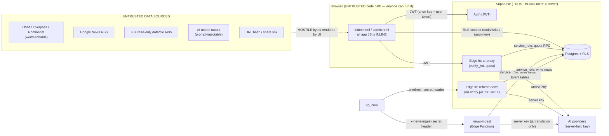

# IntMap — Security Architecture & Threat Model (#R138)

> **Verified 2026-08-20 against `acc55b1`**, including a read-only audit of the live Supabase
> project (`vpekfwdpurzejrrmacac`, Postgres **17.6**) and of the production HTTP response
> headers. What that audit could not close is in §8; what it found and closed is in §5, §6
> and §11.

Authoritative description of IntMap's attack surface, trust boundaries, authentication /
authorization model, the public-vs-secret distinction, and the residual risks + manual
production settings. Companion to [`SECURITY.md`](../SECURITY.md) (reporting) and
[`TESTING.md`](TESTING.md#security-testing) (how to run the checks). Keep this current when
the data flow, an Edge Function, or the auth model changes.

---

## 1. What we protect (assets)

| Asset | Where | Protected by |
|---|---|---|
| User account identity / session (JWT) | Supabase Auth; JWT in browser `localStorage` | Supabase Auth; **correct output-encoding** so XSS can't steal the token |
| Per-user private data (`favorites`, `user_prefs`, `donations`/`feedback`/`bug_reports` PII, `ai_usage`) | Postgres | **RLS** + column grants + SECURITY DEFINER RPCs |
| Admin capability + billing (`profiles.is_admin`/`is_pro`/`plan`/`email`) | Postgres | RLS (`is_admin()`) + column grant + **`tg_profiles_guard_privcols` BEFORE-UPDATE trigger** (grant-independent freeze, #R155) — no self-escalation of admin or billing plan |
| Provider API keys (AI, etc.) | Edge Function env (server only) | Never sent to the browser; never logged |
| AI spend / quota | `ai_usage` + `ai-proxy` | JWT-gated proxy + atomic RPC; refresh-news fail-closed secret |
| Integrity of what every visitor sees | `index.html` render paths | **XSS output-encoding** (`window.IntMapSafe`) + CSP |

**Adversaries considered:** an anonymous internet user; a *logged-in* user attacking other
users or the platform (the most important one — they hold a valid JWT and can write their own
rows via the Supabase REST API, bypassing the UI); and an attacker who can edit **third-party
data IntMap renders** (OpenStreetMap nodes, a news headline that reaches Google News RSS, a
Nominatim place name). All three are assumed hostile.

---

## 2. Trust boundaries & data flow

**The security rules that follow from this diagram:**
1. **Everything crossing into `UI` from `Untrusted` is hostile** and must be output-encoded
   before it touches the DOM (§4). The browser JS is not a trust boundary — an attacker can
   read and replay any request the page makes.
2. **Authorization lives on the server** (RLS, RPC EXECUTE grants, Edge-Function auth), never
   in the client UI. The admin console's client-side gate is UX only; the real boundary is
   RLS (proven by pgTAP).
3. **Secrets live only server-side** (Edge-Function env). The browser holds only the
   *publishable* anon key + the user's own JWT.

---

## 3. Authentication & authorization

- **AuthN:** Supabase Auth (email + Google/Apple OAuth). The session JWT is stored by the
  Supabase JS client in `localStorage` (its default; Supabase JS cannot use an httpOnly
  cookie). Consequence: **an XSS = token theft**, which is exactly why §4 is the priority.
- **AuthZ — data:** Postgres **Row Level Security** on every table + column-level UPDATE
  grants so a user can only touch their own rows and **cannot** set `is_admin`/`is_pro`/
  `plan`/`email` on their profile (no privilege escalation). See
  [`DATABASE.md`](DATABASE.md) / [`DATABASE.md`](DATABASE.md#rls--permission-testing); enforced baseline in
  `supabase/migrations/20260718090000_baseline.sql`; attack cases in `supabase/tests/*_test.sql`.
  - **(#R144) RLS is the real protection — grants are wide open in prod.** Supabase's
    schema-wide default privileges grant `anon`/`authenticated` **full** table privileges on
    every `public` table (`relacl = {authenticated=arwdDxtm,…}`), so a *column-level* grant does
    **not** actually restrict a table that has a permissive RLS policy. Where a column must stay
    server-owned even though its row is user-editable (the Area-Monitors run-state + `next_run_at`),
    protection is a **BEFORE UPDATE trigger** (`tg_monitors_guard_state`), not the grant. Tables
    whose writes are meant to be service-role-only rely on RLS **default-deny** (no write policy) —
    that holds in prod regardless of grants. pgTAP now simulates the prod grant so tests catch this.
- **AuthZ — AI quota:** `ai_usage` is writable **only** by the SECURITY DEFINER RPCs
  `increment_ai_usage` / `refund_ai_usage`, whose EXECUTE is granted to `service_role` only.
  The term-gloss lane has the identical shape in its own table (`ai_gloss_usage`,
  `consume_ai_gloss` / `refund_ai_gloss`).
  ⚠ **Which lane pays is declared in a header (`x-intmap-lane`) and is therefore not trusted.**
  Quota is consumed before the body is parsed, so the header is a claim about a body nobody has read;
  `ai-proxy` verifies it against `task` once the body IS parsed and answers 400 `bad_lane` — after
  refunding — on any mismatch in either direction. Without that check the header would be a door into
  the expensive tasks at the cheap counter's price. The cheap lane additionally refuses images and
  hosted web search and carries its own prompt ceiling.
  A user cannot inflate/deflate their own quota.
- **AuthZ — admin:** `profiles.is_admin`, checked by the `is_admin()` SECURITY DEFINER
  function (with `search_path=''`) inside the admin-only RLS policies. `admin.html`'s login
  gate is convenience; a non-admin who loads it still gets **zero** rows from RLS.

---

## 4. Frontend XSS defense (the primary control)

Because the boot code is still inline (§6) and the app holds the session token in
`localStorage`, **correct output-encoding at every sink is the primary XSS defense** (CSP is
secondary — see §6). The app IS built (Vite, since #R175) and what ships is `dist/`, but that
changes nothing here: a bundled sink is exactly as exploitable as an inline one. All untrusted text now routes through one canonical, dependency-free,
globally-defined helper, `window.IntMapSafe` (defined in the first `<head>` script):

- `IntMapSafe.html(s)` — escapes `& < > " '`; safe in HTML **text** and single/double-quoted
  **attribute** contexts.
- `IntMapSafe.url(s, {allowData})` — allows **only** `http(s)` / `mailto` / `tel` (+ raster
  `data:image`, never SVG); `javascript:` / `data:text/html` / `vbscript:` / tab-obfuscated
  schemes → `''`. For a URL in `href`/`src`/`style`, wrap as `html(url(s))` (scheme-check
  then quote-escape).

**Sinks hardened this round** (all were confirmed reachable from attacker-controlled data):

| Surface | Field(s) | Trigger |
|---|---|---|
| Community feed | `community_posts.img` → `` | auto-fires on feed render (most severe) |
| Community map pin | `title` / `body` tooltip | hover a malicious pin |
| Profile card | another user's `avatar_url` → `background:url()` | view attacker's profile |
| News | RSS `title` / `publisher` / `name` (6 sinks: card, translate re-render, 2 tooltips, mobile popup) | render / hover / tap |
| News links | article `link` → `window.open` | http(s)-only guard |
| Live-camera popup | OSM-editable `url` → iframe/video/img/`href` | open a malicious webcam |
| Place search card | Nominatim `display_name` / `type` / `country` | search → click a result |
| Earthquake / POI | USGS `place`, POI `url` | defense-in-depth |

The **Atlas AI reply** pipeline was audited and found **already safe** (it escapes before
markdown formatting and forces `https?:` on links) — unchanged. Bundled first-party GeoJSON
popups (ecoregions, volcanoes) are trusted-source and out of scope. **URL hash / share
restore, GeoJSON file import, and error rendering were audited and are safe** (hash values are
consumed as numbers/dates/layer-ids, imported properties only feed MapLibre paint layers,
error messages are escaped).

Regression guards: `tests/security.spec.js` proves the payloads stay inert in a real browser;
CodeQL runs the JS XSS queries.

---

## 5. Edge Functions & `service_role` usage

**There are fifteen Edge Functions, and this table used to list two.** `supabase/config.toml` used
to declare five and the other three carried their deploy flag only in a header comment — a deploy
flag that lives in a comment is not configuration. All fifteen are declared there now
(`aviation-feed` #R341, `routing-relay` #R347, `news-ingest` #R351, `volcano-feed` #R353,
`quotes-relay` #R533).
⚠ `supabase/functions/_shared/` is **not** a function: it is a library directory (`newsgeo.js`,
`relay-guard.js`, `atlas-persona.js`, `aviation-codec.js`, `aviation-model.js`, `news-cluster.js`,
`news-geo-prompt.js`, `news-ingest.js`, `volcano-parse.js`) that the CLI bundles into the functions that import it.

| Function | `verify_jwt` | Auth | Uses `service_role` for | Provider key |
|---|---|---|---|---|
| `ai-proxy` | **true** | Supabase JWT (login required) → 401 | plan lookup + `increment/refund_ai_usage` RPC | server env only, never logged |
| `delete-account` | **true** | Supabase JWT **and** an explicit re-check; body must be `{"confirm":"DELETE"}` | `delete_account_data(uuid)` then `auth.admin.deleteUser` | — |
| `monitor-run` | false | two callers, two credentials: pg_cron's `x-monitor-secret` (from Vault) or a user JWT; fail-closed on the secret | claim/finalize monitor runs | server env only |
| `refresh-news` | false (by design) | **fail-closed shared secret** (`x-refresh-secret` header, constant-time) | write `current_news`, read `geo_pins` | server env only |
| `news-ingest` | false (by design) | **fail-closed shared secret** (`x-news-ingest-secret` header, constant-time, POST only) | write the `news_*` Event tables; read `news_sources` / `news_source_feeds` | server env only |
| `alerts-relay` | false | none — keyless public relay of official warning feeds | — | — |
| `cable-geo` | false | none — keyless public relay of two TeleGeography GeoJSON URLs | — | — |
| `news-relay` | false | none — keyless public relay of Google News RSS | — | — |
| `routing-relay` | false | none — public, but **keyed upstream**: it is the only relay that holds a provider token | — | `MAPBOX_TOKEN`, server env only, never returned |
| `sv-cov` | false | none — keyless public relay of Google Street-View coverage tiles | — | — |
| `quotes-relay` | false | none — keyless public relay of two Yahoo Finance v8 endpoints (share prices) | — | — (those endpoints need no key) |
| `aviation-feed` | false | none — keyless; serves live ADS-B to signed-out readers | — | provider key (when a provider needs one) + `AVIATION_STORAGE_KEY` for the snapshot object: **server env only, never returned, never logged** |
| `ais-feed` | false | none — keyless; serves live ships to signed-out readers. The caller may pass a viewport box, never a URL | — | `AISSTREAM_API_KEY` (optional; Digitraffic needs none) + `AIS_STORAGE_KEY` for the snapshot object: **server env only, never returned, never logged** — the diagnostic trace reports the key's LENGTH and whether it is alphanumeric, never the key |

**`aviation-feed` is keyless but is NOT one of the relays**, and the distinction is a security
property rather than a naming one. A relay forwards a URL **the caller named**, which is why the
five below need an allow-list. `aviation-feed` names its own upstreams — the caller may choose
only a channel (`world` / `view` / `meta`) — so no caller-supplied string ever reaches `fetch()`
and there is no allow-list to get wrong. It takes the rest of `relay-guard.js` unchanged: GET
only, a deadline, a byte ceiling, a content-type check, and errors that name a bound and never an
exception. Its `?meta=1` channel reports the PRESENCE of its credentials as booleans and never
their values.

`ais-feed` is the same shape: a channel and a viewport box, never a URL.

⚠ **(#R533) `quotes-relay` IS a relay — it forwards a caller-named URL — and its allow-list is
therefore the whole of its security.** It is written structurally rather than as a prefix test,
because `startsWith` on a whitelisted string is not a test of where a URL points: the string is
parsed with `URL`, the host must be one of two Yahoo hosts, the path must be `/v8/finance/spark`
or `/v8/finance/chart/<symbol>`, **every** query parameter must be one of five known keys (any
other key, and any fragment, rejects the request outright rather than being dropped), symbols
match a character class and are capped in count, and timestamps must be digits. The upstream
needs no key, so there is no credential here to leak; what crosses the boundary is which tickers
a reader's board is showing. Everything else is `relay-guard.js` as for the others.

⚠ **(#R347) `routing-relay` is the first relay that is not keyless, and it differs in three ways.**
(1) It holds `MAPBOX_TOKEN`, so it is the one relay a caller could try to use as a **general Mapbox
proxy**: the profile is an allow-list of four, the query parameters are an allow-list of twenty-one
and everything else is **dropped in silence**, the coordinate list is validated to range and count,
and a caller-supplied `access_token` is **deleted before the upstream URL is built** — it is in no
list, and our own token is set afterwards.
(2) It is the only relay that **must not cache**. Mapbox Product Terms §2.10.1 forbids caching or
storing Navigation API results, so every response — including the failures — carries
`Cache-Control: no-store` where the other four set `s-maxage`. `js/routing-traffic.js` honours the
same rule on the client by reading `IntMapRouteProviders.noStore('mapbox')` rather than hardcoding it.
(3) It is the only relay with its own **rate limit** (60 requests per minute per `x-forwarded-for`),
because Mapbox has no hard spend cap — this is the only ceiling. ⚠ It is **per-isolate and
best-effort**, and the function says so in its own header rather than implying an accounting
boundary; the real ceiling remains the provider account's usage alerts.
⚠ **With no key set the function is inert**: `?probe=1` answers `{"mapbox":false}` and every route
request returns `provider_unavailable`, so the app falls back to the open routers and says so.

**The five keyless relays are not protected by a login and must not be** — they serve map
layers, and now share prices, to signed-out readers. What stands in front of them is
`_shared/relay-guard.js`, shared
so the five cannot drift apart: a URL **allow-list** (exact strings for cable-geo, an
endpoint-shaped rule for news-relay, host+path for alerts-relay, host+path+`lyrs`+a z/x/y that
must be **on the pyramid** for sv-cov, host+path+a closed parameter set for quotes-relay),
**GET only**, a **deadline** on every upstream fetch, a
**byte ceiling** enforced on `content-length` *and* while streaming (an upstream may omit the
length), a **content-type** rule, and **generic outward errors** — the caller learns which
bound was hit and never what the exception said (CodeQL `js/stack-trace-exposure`).
`alerts-relay` additionally **deduplicates** its `?ma=` country list and caps it at the six the
client asks for; it accepted forty, each up to a measured 10.28 MB, so one ~300-byte
unauthenticated GET could ask it to pull ~400 MB from EUMETNET.

- **`ai-proxy`** verifies the user, resolves plan → daily limit, **atomically** consumes one
  use, calls the provider with the server-held key, refunds on failure, and bounds its input.
  Errors are typed; **prompt / key / JWT are never logged** (metadata only). CORS is `*` but
  that is safe: every request needs a valid user JWT that a cross-origin site cannot obtain.
  The bounds, and why each is where it is: `MAX_PROMPT=24000` and `MAX_IMAGES=4` were applied
  **after** `await req.json()`, i.e. after the whole body had been read and parsed, so
  `MAX_BODY_BYTES=20 MB` is now checked on `content-length` and again on the bytes read;
  images must be one of four raster MIME types (`image/svg+xml` used to pass), must be valid
  base64, and are capped **per image** (4 MB decoded) and **in total** (12 MB); `task` is an
  allow-list of the ten tasks the code defines rather than an arbitrary string used to index
  four configuration objects; a caller-supplied `responseSchema` is bounded by size, depth and
  key count and rejected if it contains a prototype key.
  ⚠ **The upstream error body is no longer echoed.** `pe.meta.bodySnippet = t.slice(0,160)`
  was written as server-log-only, but `meta` is spread into the JSON response — so 160 bytes
  of whatever the provider answered with went to the caller too. Only its **length** is kept.
  ⚠ **The developer override is an id, not an address.** A real e-mail address was compiled
  into this **public** repository and the exemption depended on `auth.users.email`, a field a
  provider can re-issue. It reads the `DEV_USER_IDS` secret now. Audited 2026-08-20: that
  address matched **0 of 56** production accounts, so the constant had never granted anything.
- **`delete-account`** ran one DELETE per hard-coded table over PostgREST, ignored the ones
  that failed, and removed the auth user **either way** — fail-OPEN in the one direction that
  matters, because once `auth.users` is gone the person cannot sign in to ask again. It is one
  transaction now: `public.delete_account_data(uuid)` **discovers** the owned tables from the
  foreign keys to `auth.users` (plus any `user_id uuid` column whose FK is missing — audited,
  `bug_reports` is exactly that case in production), deletes them, **re-counts**, and raises if
  anything survives. The auth user is deleted only after that returns `ok`.
  ⚠ The FK cascade is not a substitute: `donations`, `feedback` and `bug_reports` are
  `ON DELETE SET NULL`, so deleting the auth user would leave the person's own submitted text
  behind with a NULL owner.
- **`refresh-news`** (#R138) is **fail-closed**: `REFRESH_SECRET` **must** be set or every
  request is refused (503) — it never runs publicly. The secret is read **only** from the
  `x-refresh-secret` header (never a URL query, so it can't reach access logs) and compared in
  **constant time**. Only `POST` triggers a run. This closes the previous fail-open design
  where an unset secret let anyone trigger paid AI + `service_role` DB writes. `service_role`
  bypasses RLS, so it is confined to these two server functions and never reaches the browser.

---

## 6. Browser security — CSP & the GitHub Pages limits

IntMap is served by **GitHub Pages**, which **cannot set custom HTTP response headers**. Since
#R175 it *is* built (Vite), but the boot code is still inline in `index.html` — measured, the
published `dist/index.html` contains five inline `<script>` blocks — and the app fetches from
**60+ external hosts**, so a nonce/hash `script-src` and a host-list `connect-src` remain out
of reach. The chosen posture:

- **In-page CSP (`<meta http-equiv>`), verified in a real browser against the built site.**
  ⚠ **The policy used to name five directives and have no `default-src`.** A directive that is
  absent *and* has nothing to fall back on is not permissive, it is **absent**: `connect-src`,
  `img-src`, `style-src`, `font-src`, `media-src`, `form-action`, `manifest-src` and every
  directive a future browser adds were unconstrained, and the policy could not say whether that
  was a decision. There is a `default-src 'self'` now, and fourteen directives are written
  down: `base-uri 'self'`, `object-src 'none'`, `form-action 'self'`, `manifest-src 'self'`,
  `frame-src 'self' https: blob:`, `child-src`/`worker-src 'self' blob:`,
  `connect-src 'self' https: wss: data: blob:`, `img-src`/`media-src 'self' https: data: blob:`,
  `style-src 'self' 'unsafe-inline' https://fonts.googleapis.com`,
  `font-src 'self' data: https://fonts.gstatic.com`, and a `script-src` **host list**.
  `style-src` and `font-src` are exact lists because Google Fonts is the only external
  stylesheet and the only external font host in the tree; `connect-src` stays `https: wss:`
  because naming ~60 data hosts is a list that goes stale as a *silently missing layer*.
  `script-src` lost `https://cdn.jsdelivr.net`: measured across the tree, jsDelivr is only ever
  a `fetch()` target here, and the one page that loaded a `<script>` from it was `admin.html`,
  which bundles its SDK now. `<meta name="referrer" content="strict-origin-when-cross-origin">`.
  ⚠ `frame-ancestors` is **ignored** in a `<meta>` policy, so it is deliberately not written
  there rather than written and silently inert.
- **The admin console's policy is stricter and lost two entries**, each of which had exactly
  one reason to exist: `https://cdn.jsdelivr.net` (the SDK fallback wrote a `<script>` at the
  floating tag `@supabase/supabase-js@2` into the parser — measured, that fallback ran *every*
  time, because the local file it tried first has never existed in this repo) and
  `'unsafe-eval'` (the starter-dataset import ran an operator-chosen file as code). The SDK is
  vendored from this repo's own pinned dependency to `dist/vendor/supabase-js.js`, and the
  import calls `js/admin-literal.js` — a **parser** for the object/array-literal grammar those
  files are written in, which throws a `SyntaxError` on anything that is not data and cannot
  invoke anything.
- **Production source maps are no longer published.** `sourcemap: true` put `dist/assets/*.map`
  into the deploy; measured on production, `assets/main-VdS_tG39.js.map` answered **200 with
  8,810,729 bytes** — a complete copy of every original source, comments included. The build
  emits none unless `IM_SOURCEMAP=1`.
- **Because `'unsafe-inline'` is unavoidable, output-encoding (§4) — not CSP — is the primary
  XSS defense.** The CSP is defense-in-depth.
- **Header-only controls GitHub Pages cannot provide** — `X-Frame-Options` / CSP
  `frame-ancestors` (clickjacking), HSTS, `Permissions-Policy`, a header-form CSP. Documented
  here as a residual limitation. Mitigations: IntMap performs no sensitive state-changing
  action by click alone that clickjacking would meaningfully abuse; all `target="_blank"`
  links carry `rel="noopener"` and every `window.open` passes `noopener` (no reverse
  tabnabbing); GitHub Pages is HTTPS-only in practice. If the site is ever moved behind a host
  that can set headers (e.g. Cloudflare), add `frame-ancestors 'self'` / `X-Frame-Options:
  SAMEORIGIN` / HSTS there.

---

## 7. External data & privacy

IntMap calls **60+ public, read-only** third-party APIs (map/satellite tiles, elevation/
weather, routing, statistics, news, geocoding, market data, live cameras, AI providers). The
**full, user-facing list with exactly what is sent** is in the in-app Privacy Policy
(`index.html`, "第三者 / Third parties"). Security-relevant notes:

- Some camera-list endpoints and the Google News RSS feeds are fetched via **public CORS relays**
  (`corsproxy.io`, `allorigins.win`, `proxy.corsfix.com`, `codetabs.com`) — the relay sees the
  request; no personal data is sent. (#R214) `corsfix` was added because a relay that works is not
  a relay that works for every target: Google served the `en-US` news edition through `corsproxy.io`
  and answered the same proxy with its bot-block page for `ja-JP`.
  ⚠ **(#R533) No feature depends on that ladder alone any more.** Share prices used to reach Yahoo
  through a private three-rung ladder inside `js/companies.js`; measured 2026-09-07, the direct
  call returned 200 with no `Access-Control-Allow-Origin`, `corsproxy.io` returned 403 and
  `api.allorigins.win` returned 522 — three rungs, no answer. Our own function goes first now and
  the shared public ladder (`js/proxy-fetch.js`) stands behind it, which is the same arrangement
  news and GDELT already had. See `../DECISIONS.md`.
- **(#R533) Company logos are shipped, not asked for.** The Companies tab used to name a
  third-party logo API (`logo.clearbit.com`) once per company, which both told that host which
  companies a reader was looking at and, after the service was shut down on 2025-12-08, produced
  189 `ERR_NAME_NOT_RESOLVED` failures per open — the host no longer resolves at all. The logo is
  now resolved at **build** time from Wikidata P154 to Wikimedia Commons and shipped in
  `data/companies/` (435 of 533 companies); the remaining companies fall back to Google's favicon
  service, which is sent the company's domain and nothing else, and then to a monogram, which
  sends nothing. For a company that ships a logo the tab makes **no third-party request at all**,
  where before it made one per row; only the 98 Wikidata has no P154 for still reach a stranger,
  and what they send is a domain name.
  The reasoning is in `../DECISIONS.md`; the data path is in `COMPANIES.md` §4.3.
- **No PII in URL query strings**; error monitoring (Sentry, dormant) strips PII / tokens /
  query strings and only reports IntMap's own exceptions.
- Analytics: **paused.** Google Analytics (gtag) and Microsoft Clarity are still in `index.html`
  and still allowlisted in the CSP, but both loaders sit behind one switch — `window.INTMAP_ANALYTICS`,
  declared `false` — so no request reaches `www.googletagmanager.com` or `www.clarity.ms`, no GA
  cookie is set, and no session replay is recorded. The queue shims (`gtag()`, `clarity()`) are
  still defined, so any caller queues harmlessly instead of throwing.
  ⚠ **They were stopped because the privacy text named neither of them** — not because the tags
  were faulty. `js/legal-text.js` §4 lists dozens of third parties in nine languages and omitted
  the only two that set a cookie and record a DOM replay; §5 says "Cookies & local storage — used
  for your session and preferences" and nothing about measurement. `tests/r502-checks.test.mjs ④`
  ties the switch to that text: setting it back to `true` without naming **Google Analytics** and
  **Clarity** in `js/legal-text.js` turns the gate red. Turning measurement back on and disclosing
  it are therefore one action, not two.
  ⚠ **Neither may see an auth return URL** (this governs the tags whenever they are switched on). An OAuth return and a magic-link click land on the
  page with the credential *in the URL* (`?code=…`, `#access_token=…&refresh_token=…`) until
  supabase-js finishes `detectSessionInUrl`, which is a network round trip. GA has been given a
  sanitised `page_location` since #R155 (`__imScrubAuthUrl`); **Clarity had not been**, and
  Clarity records the page URL and a DOM replay. Inserting its tag on an idle callback made
  that a race. The tag is now simply not inserted while an auth parameter is present, re-checked
  until the URL is clean, and skipped for that page-load if it never becomes clean.

---

## 8. Residual risks (accepted / tracked)

1. **`'unsafe-inline'`/`'unsafe-eval'` in `script-src`** — the boot code is inline (five
   `<script>` blocks in the built `index.html`) and Cesium/KaTeX compile at runtime. Removing
   either is a rewrite of how the app loads, not a policy edit. Mitigated by output-encoding
   (§4). ⚠ **Not removable by moving the remaining inline event attributes**, which is why they
   were only moved where a *value* was being interpolated into one (see §11.4).
2. **JWT in `localStorage`** — Supabase JS default; mitigated by the XSS fixes. An httpOnly
   cookie would need a different auth transport.
3. **Header-only browser controls** not settable on GitHub Pages (§6). MEASURED 2026-08-20:
   production returns HSTS (GitHub's own) and nothing else; no `X-Content-Type-Options`, no
   `X-Frame-Options`, no `Referrer-Policy`, no `Permissions-Policy`, no CSP header. A host that
   can set headers (Cloudflare — see `RELEASE.md`, where it is described only as an **optional
   PR-preview** target and is **not** in front of production) would close all five.
4. **Public CORS relays** for some camera lists (§7) — third-party sees the request.
5. **Nine `mgmt_*` tables exist in production and in no migration in this repo**
   (`mgmt_cases`, `mgmt_passkeys`, `mgmt_incidents`, `mgmt_approvals`, `mgmt_changes`,
   `mgmt_documents`, `mgmt_improvements`, `mgmt_notices`, `mgmt_ai_suggestions`). RLS is on and
   they have **zero policies**, so every row operation by `anon`/`authenticated` is denied — but
   they hold table-level `INSERT/UPDATE/DELETE/**TRUNCATE**` for both roles, and **TRUNCATE is
   not subject to RLS**. It is not reachable through PostgREST, which exposes no TRUNCATE, so
   this is an over-grant rather than an open door. Left untouched **by decision**: they belong
   to something outside this repository and revoking could break it. To close:
   `revoke insert, update, delete, truncate on public.mgmt_* from anon, authenticated;`
6. **Default privileges in `public` and `storage` grant `anon`/`authenticated` ALL — including
   TRUNCATE — on every table created in future.** This is the Supabase default, it is the root
   cause of the #R155 blanket-UPDATE escalation, and it is how the `mgmt_*` tables acquired
   their grants without anyone writing a `grant`. Every table this repo's migrations create has
   an explicit grant, so tightening it would not affect IntMap; it would affect anything else
   that creates tables here. Left untouched **by decision**. To close:
   `alter default privileges in schema public revoke all on tables from anon, authenticated;`
7. ~~**`public.profiles_public` is not `security_invoker`**~~ — **CLOSED by #R507.** It was a
   view without `security_invoker`, so it read `profiles` with the view owner's rights and
   bypassed that table's RLS; the projection was only `id, display_name, bio, avatar_url`, so
   nothing leaked, and this entry recorded the risk that a future column added to it would
   inherit the bypass. Supabase's own advisor raised it as level **ERROR** (lint
   `0010_security_definer_view`). The advisor's remedy — `security_invoker = on` — was **not**
   taken: `profiles` has a single owner-or-admin SELECT policy, so an invoker view would return
   the caller's own row and `anon` would get a permission error, and making it work would mean
   a `USING (true)` policy on `profiles` with column grants as the only barrier — the barrier
   #R155 proved untrustworthy (item 6 above is why). Instead `profiles_public` is now a **real
   table** holding only the four public columns, RLS on, one `SELECT USING (true)` policy, no
   write grant, kept in step by the `profiles_public_sync` trigger. There is no bypass left for
   a future column to inherit, because the column would not be in this table.
8. **`supabase/config.toml` still says `db.major_version = 15`; production is Postgres 17.6.**
   The file drives only the LOCAL stack, so this affects the fidelity of `supabase db diff`, not
   production. Recorded rather than changed because raising it changes what every local reset
   and every CI pgTAP run executes against, which is a test-infrastructure decision of its own.
9. **Passkeys are enabled on the project** (`GET /auth/v1/settings` → `passkeys_enabled: true`)
   and `config.toml` says nothing about them. No factor is enrolled (`auth.mfa_factors` is
   empty), so nothing depends on it today.
10. **The maintainer's e-mail address remains in this repository's git HISTORY.** It was removed
   from every tracked file (`ai-proxy`, `static-checks.mjs`, `js/ai-core.js`, `js/auth-ui.js`);
   removing it from past commits means rewriting published history, which is destructive and out
   of scope for this change.
11. **The service worker's cache-first store is still keyed on host allow-lists**, and one entry
   is `s3.amazonaws.com` for the terrarium DEM. The six exact hostnames are listed by name (not
   by suffix) precisely so that "any S3 bucket serving a `/terrarium/` path" is not admitted.
5. **AI content-sharing**: when the active provider is OpenAI, submitted text/outputs may be
   used by OpenAI to improve its models (disclosed in-app); users are told not to submit
   sensitive data.
6. **The unwired in-app article reader** (`openArticleInSidebar`, still no caller — re-measured
   #R430) builds its web mode with `sandbox="allow-same-origin allow-scripts allow-popups
   allow-forms"` (`js/news-ui.js`) — **four tokens, not the two this entry claimed until #R430**.
   `escForReader` quote-escapes, so its attribute sinks are safe; if it is ever re-wired, drop
   `allow-same-origin` (and reconsider `allow-popups` / `allow-forms`, which were never reviewed
   here because nobody could reach the code that sets them).
   ⚠ #R430 fed Atlas's open-article bridge (`window._imReader`) from the Event detail and the
   article card's Read click instead of re-wiring this reader, so **this iframe is still
   unreachable** and the paragraph above is still a statement about dormant code.

---

## 9. Manual production settings (operator — cannot be set from code)

These are **not** applied by this PR. Apply them in the GitHub / Supabase dashboards. **Never
put a real secret value in the repo, a PR, or a log.**

### GitHub (repo → Settings)
- **Code security**: enable **Secret scanning** + **Push protection**; enable **Private
  vulnerability reporting**; confirm **Dependabot alerts** (config already in
  `.github/dependabot.yml`); **CodeQL** runs from `security.yml` (free for this public repo).
- **Branch protection / ruleset on `main`**: require PRs; require status checks **CI** (static
  + browser) and **Database checks** (and optionally **Security / CodeQL**) to pass; no direct
  pushes; keep **Actions default permissions = read** (workflows already set least privilege).

### Supabase (project `vpekfwdpurzejrrmacac`)
- **`refresh-news` — REQUIRED (this PR makes it fail-closed):**
  1. `supabase secrets set REFRESH_SECRET=<a long random value>` (do not paste the value
     anywhere in the repo).
  2. Update the pg_cron job to send the **header** `x-refresh-secret: <REFRESH_SECRET>` when it
     POSTs the function (header only — never `?secret=` in the URL). Example net.http_post
     call shape (secret injected from a secure setting, not literal):
     `select net.http_post(url:='https://<ref>.functions.supabase.co/refresh-news',
      headers:=jsonb_build_object('Content-Type','application/json','x-refresh-secret', current_setting('app.refresh_secret')));`
  3. Redeploy: `supabase functions deploy refresh-news --no-verify-jwt` (maintainer, gated).
     Until the secret is set + cron updated, news refresh is intentionally **off** (fail-safe).
- **Auth → URL Configuration**: confirm the production **Site URL** and **Redirect URLs** are
  the real production origins only (no wildcard, no stray localhost) to prevent open-redirect
  on OAuth. The R155 **password-reset** and **email-change** flows email a link back to
  `location.origin + location.pathname`, so that exact URL (`https://rwmqx7dwb5-arch.github.io/IntMap/`)
  MUST be in the Redirect URLs list or those links will bounce.
- **Auth → Passwords (#R155) — REQUIRED for the breached-password guarantee:** enable
  **"Leaked password protection"** (HIBP, server-side) and set **Minimum password length = 8**
  with the character requirement matching `supabase/config.toml` (`lower_upper_letters_digits`).
  The client mirrors this + runs its own HIBP k-anonymity check, but the dashboard toggle is the
  authoritative server-side guard and is NOT reproducible from the repo.
- **Auth → Passkeys / WebAuthn (#R155) — REQUIRED for passkeys to work:** configure the
  **Relying Party ID = `rwmqx7dwb5-arch.github.io`** (the bare host; `github.io` is on the public
  suffix list so the full host must be used) and add the **Relying Party Origin
  `https://rwmqx7dwb5-arch.github.io`**, then enable passkeys. Until this is set, the client's
  passkey buttons degrade gracefully to password auth (feature-detected). supabase-js ≥ 2.105 is
  required; the app no longer takes it from a CDN at all — `src/vendor.js` imports the version
  `package.json` pins, so **check that pin** (and `admin.html`'s vendored copy) when this matters.
- **Auth → SMTP**: for reliable delivery of confirmation / reset / email-change mails at volume,
  configure a custom SMTP sender (the default Supabase mailer is rate-limited). Optional but
  recommended once real users exist.
- **Auth → Bot protection (CAPTCHA)**: optionally enable hCaptcha/Turnstile on signup + password
  reset to blunt automated abuse of those public endpoints (the client already sends no data that
  would leak, and the flows are enumeration-safe).
- **Postgres version**: confirm `supabase/config.toml` `db.major_version` matches production
  (for faithful `db diff`).
- **Migrations**: apply `20260720120000_security_hardening.sql` **and `20260722100000_security_r155.sql`**
  via the gated flow in [`MIGRATIONS.md`](MIGRATIONS.md) (both are additive/idempotent; the R155
  length caps are `NOT VALID`, safe against a pre-existing oversized row). **R155 was already
  applied to production on 2026-07-22 via the Management API** and verified (profiles PII leak +
  is_pro/plan escalation closed) — re-applying is a no-op.
- **`delete-account` Edge Function (#R155)**: deployed with `verify_jwt` on
  (`supabase functions deploy delete-account`). No secrets beyond the injected service-role key.
- **Backups**: register the backup secrets so `db-backup.yml` can run (see
  [`BACKUP-RESTORE.md`](BACKUP-RESTORE.md)).

---

## 11. R155 — auth hardening, DB reconciliation & account lifecycle

Prod had **drifted** from the migration files; a live audit (`supabase db query --linked`,
2026-07-22) found the reconstructed baseline overstated how locked-down production was. Two
**live criticals**, both on `profiles`, plus a full auth-lifecycle build-out:

### 11.1 The two production criticals (found + fixed + verified same day)
- **PII leak (critical).** `profiles` carried **two** redundant `SELECT … USING (true)` RLS
  policies granted to the `public` role. RLS ORs policies, so these overrode the intended
  own-or-admin policy: **any anon/authenticated caller could read every user's `email`,
  `is_admin`, `is_pro`, `plan`** via the public anon key. Fixed by dropping both permissive
  policies and adding `profiles_public` (id/display_name/bio/avatar_url only — a view then, a
  table since #R507) — which the client already reads first (`imViewProfile`, #R134).
- **Privilege / billing escalation (high).** Supabase's schema-wide DEFAULT PRIVILEGES grant
  every role a blanket table-level `UPDATE` on every public table, and profiles' UPDATE policy
  is row-only (no column filter). A pre-existing `guard_admin_flag` trigger froze `is_admin`
  specifically, so admin self-promotion was defended-in-fact — **but it left `is_pro`/`plan`
  unguarded**, so a user could `update profiles set plan='unlimited'` to grant themselves the
  paid AI quota / raised monitor cap. Fixed by revoking the table-level UPDATE (column grant
  only) **and** adding `tg_profiles_guard_privcols` — a grant-independent BEFORE UPDATE trigger
  that freezes `is_admin`/`is_pro`/`plan`/`email` for any non-`service_role` caller (the R144
  pattern applied to profiles), which supersedes and replaces the narrow `guard_admin_flag`.

### 11.2 Least-privilege reconciliation (`20260722100000_security_r155.sql`)
Revoked the default `ALL` from `anon`/`authenticated` on **every** public table and re-granted
only the baseline's intended minimal set — including the monitor child tables (`monitor_runs`/
`_evidence`/`_reports`), which R144 had missed, so "run results cannot be forged" now holds at
the grant layer too, not just via RLS. Added `NOT VALID` length caps on the anon/user-insertable
text (`feedback`/`bug_reports`/`community_*`) as an abuse/DoS guard. The prod-only `rls_auto_enable`
event trigger (auto-enables RLS on any new public table — a good fail-closed default) was kept.
Proven by **pgTAP `05_r155_security_test.sql`**, which reproduces the prod condition on CI (grants
`authenticated` the blanket UPDATE) and asserts the guard trigger still blocks escalation — the
one thing vanilla CI could not otherwise reproduce.

### 11.3 Account lifecycle & auth hardening (client + Edge Function)
- **Account deletion (real, not logout):** `delete-account` Edge Function — JWT-gated,
  `confirm:"DELETE"` required, explicit owned-row purge across every user-owned table, then
  `auth.admin.deleteUser`. The account menu has a type-your-email confirmation.
- **Passkeys (WebAuthn):** `supabase-js` `experimental.passkey` — sign-in on the login modal,
  enroll/list/remove in the account Security section. Feature-detected (`browserSupportsWebAuthn`
  + method presence) with graceful password fallback.
- **Password reset / change, email change, log-out-all-devices:** `resetPasswordForEmail` +
  `PASSWORD_RECOVERY` → a strength-and-breach-gated set-password modal; `updateUser({password})`
  / `updateUser({email})`; `signOut({scope:'global'})`.
- **Weak/breached password rejection:** client strength gate (8+, lower/upper/digit — mirrors the
  `config.toml` server floor) **and** a Have-I-Been-Pwned k-anonymity check (only the first 5 hex
  of the SHA-1 leaves the device; fail-open so an HIBP outage never blocks a real signup). The
  dashboard's server-side leaked-password protection (§9) is the authoritative backstop.
- **Account-enumeration safety:** identical signup message whether or not the email exists; a
  single generic "invalid email or password"; enumeration-safe reset wording. Same in `admin.html`.
- **Token-leak prevention:** GA `page_location`/`page_referrer` are sanitized to strip
  `code`/`access_token`/`refresh_token`/`token_hash`; OAuth + reset `redirectTo` are origin+path
  only; `referrer` meta is `strict-origin-when-cross-origin`.

### 11.4 Admin console isolation (`admin.html`)
Removed the public **Sign Up** (admins are DB-provisioned; the real boundary is RLS/RPC + the
profiles guard trigger, so a non-admin who signs in is bounced by `gate()`). Added a **strict CSP**
(`connect-src` locked to self + `*.supabase.co`; `object-src 'none'`; `base-uri`/`form-action 'self'`),
hardened the local escaper to also escape the single quote, added a `safeUrl()` scheme allow-list,
and a **re-authentication ("sudo") gate** before the destructive starter-dataset import. Behavioural
XSS tests for `esc()`/`safeUrl()` live in `tests/r155-checks.test.mjs`.

---

## 10. Reporting
See [`SECURITY.md`](../SECURITY.md).
